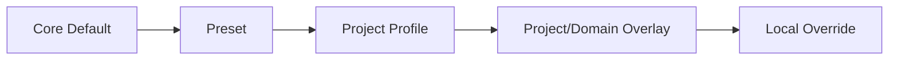
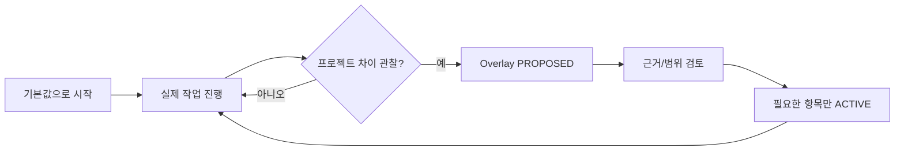

# Harness 커스터마이징 가이드

## Quick Start

**프로젝트 시작 전에 모든 커스텀을 결정하지 않는다.** Core Default로 먼저 시작하고, 실제 프로젝트를 진행하면서 차이가 관찰된 항목만 Overlay로 추가한다.



우선순위:

`LOCAL_OVERRIDE > DOMAIN_OVERLAY > PROJECT_OVERLAY > PROJECT_PROFILE > PRESET > CORE_DEFAULT`

## 1. 기존 프로젝트

`/setup` 또는 P1 Foundation Bootstrap이 README/가이드/Source/Build/Test/DB/Interface를 JIT로 탐색한다.



기존 프로젝트 규칙과 실제 구조를 재사용하여 처음부터 Harness 설정을 다시 쓰는 일을 줄인다.

## 2. 사전 커스터마이징을 요구하지 않는 항목

다음은 프로젝트 시작 전에 확정하지 않아도 된다.

- 모든 Source 탐색 경로
- 모든 Stage 별칭/표시 여부
- 모든 산출물 생성 여부
- 모든 업무용어
- 모든 개발 표준 차이
- 모든 Provider/도구 연결
- 모든 Template Section 차이

필요 시 `OPEN`으로 두고 작업을 진행한다. 실제 작업에서 필요해지는 시점에만 탐색/확정한다.

## 3. Overlay를 만드는 조건

다음 경우에만 Overlay를 만든다.

- Core/Profile과 실제 프로젝트 구조가 충돌함
- 프로젝트 고유 용어나 파일/Stage 규칙이 실제 산출물에 필요함
- Source/Provider/Build/Test 경로가 실제 프로젝트에 바인딩되어야 함
- 프로젝트 표준이 Core Default와 실제로 다름

다음은 Overlay 생성 사유가 아니다.

- 나중에 필요할 것 같음
- Sample/Pilot에 해당 값이 있었음
- 프로젝트 근거 없는 개인 선호

## 4. Overlay Lifecycle

Overlay는 처음 `PROPOSED`로 생성한다.

필수 기록:

- 적용 Project/Domain/대상 Scope
- Trigger와 Reason
- GIVEN/OBSERVED 등 근거 상태
- Evidence/Source Reference
- 변경할 `target_key`
- 기존값과 프로젝트값
- Revision

검토 후 실제 필요한 것만 `ACTIVE`로 바꾼다. 더 이상 유효하지 않으면 `SUPERSEDED`, 사용하지 않으면 `REJECTED`로 둔다.

Core Config 전체를 Overlay에 복제하지 않는다.

Template:

`sdlc/templates/project-overlay.yaml`

검증:

```text
python sdlc/scripts/validate_p1_foundation.py overlay <overlay.yaml>
```

적용:

```text
python sdlc/scripts/resolve_project_overlay.py <project-profile.yaml> <overlay1.yaml> <overlay2.yaml> -o <resolved.yaml>
```

`ACTIVE` Overlay만 적용되고 `PROPOSED`는 적용되지 않는다.

## 5. 코드 수정 없이 바꿀 수 있어야 하는 것

- Stage 별칭/표시/사용 여부
- 산출물 생성 여부와 파일명 suffix
- 한글 용어와 Work List 컬럼명
- Template Section
- Domain Rule/Standard
- Alert 정책
- Source/Guide 탐색 경로
- Provider/Adapter binding
- PM Optional 컬럼

단, P0의 Truth/Safety Contract 자체를 Project Overlay로 약화하지 않는다.

## 6. 권장 폴더

```text
sdlc/custom/
├─ project/
├─ domain/<domain>/
└─ presets/
```

실제 프로젝트에서는 필요한 Overlay가 발생했을 때만 파일을 추가한다. 빈 프로젝트에서 디렉터리를 미리 모든 조합으로 채울 필요는 없다.

## 7. Knowledge와 프로젝트 차이

반복해서 재사용할 프로젝트 사실은 Overlay보다 Knowledge Candidate가 더 적합할 수 있다.

- Overlay: Harness 동작/경로/표준/용어 등의 프로젝트 차이
- Knowledge: 업무규칙/프로세스/프로그램 책임/Data/Interface/운영 제약 등 재사용 사실

Source에서 관찰한 동작은 `OBSERVED`이며 사람 또는 공식 문서 근거 없이 Business Truth를 자동 `CONFIRMED`하지 않는다.

## 8. OPEN과 Guard

미확정 커스텀이 있어도 일반 분석/설계는 계속할 수 있다.

- 미확정 경로/용어/문서 → `OPEN` + 진행
- Source write/DB write/Publish/Deploy 등 부작용 Action → 필요한 경우 해당 Action만 Guard

## 9. 신규 프로젝트

Greenfield도 동일 정책을 사용한다. Preset으로 시작하고 실제 구현 과정에서 필요한 차이만 Overlay로 추가한다.

## 10. 변경 검증

Override가 기존 ACTIVE Capability를 제거하거나 P0 Safety Contract를 약화하면 Validator가 실패하거나 경고한다. 이 경고는 Harness 품질에 반영하지만, 위험한 실제 Action이 아닌 일반 Workflow 전체를 강제로 멈추지는 않는다.

## 11. Mermaid 작성 규칙

커스터마이징된 용어가 `/`, `?`, `(`, `)` 등 특수문자를 포함할 수 있으므로 Diagram Template의 라벨은 `A["라벨"]`, `Q{"질문?"}` 형태를 기본값으로 사용한다.
