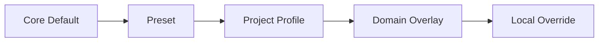
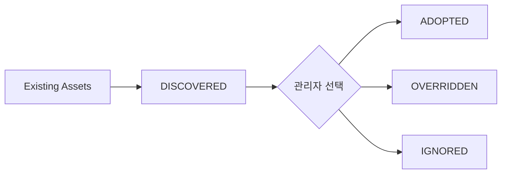

# Harness 커스터마이징 가이드

## Quick Start

Core Script를 먼저 수정하지 않는다. 아래 우선순위로 차이만 덮어쓴다.



## 1. 기존 프로젝트

`/setup`이 README/가이드/Source/Build/Test/DB/Interface를 탐색해 Project Profile 후보를 만든다.



기존 프로젝트 규칙과 실제 구조를 재사용하여 처음부터 Harness 설정을 다시 쓰는 일을 줄인다.

## 2. 신규 프로젝트

기술스택/아키텍처에 맞는 Preset을 선택하고 필요한 차이만 Override한다.

## 3. 코드 수정 없이 바꿀 수 있어야 하는 것

- Stage 별칭/표시/사용 여부
- 산출물 생성 여부와 파일명 suffix
- 한글 용어와 Work List 컬럼명
- Template Section
- Domain Rule/Standard
- Alert 정책
- Source/Guide 탐색 경로
- PM Optional 컬럼

## 4. 권장 폴더

```text
sdlc/custom/
├─ project/
├─ domain/<domain>/
└─ presets/
```

## 5. 변경 검증

Override가 기존 ACTIVE Capability를 제거하면 Continuity Validator가 경고한다. 이 경고는 Harness 배포 품질에 반영하지만 사용자의 일반 업무 프로세스 자체를 강제로 멈추지는 않는다.

## 6. Mermaid 작성 규칙

커스터마이징된 용어가 `/`, `?`, `(`, `)` 등 특수문자를 포함할 수 있으므로 Diagram Template의 라벨은 `A["라벨"]`, `Q{"질문?"}` 형태를 기본값으로 사용한다.
