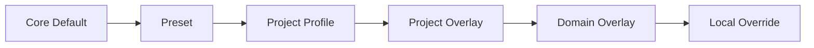
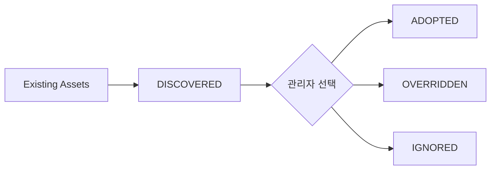

# Harness 커스터마이징 가이드

## Quick Start

Core Rule/Skill/Template를 먼저 수정하지 않는다. 아래 우선순위로 차이만 덮어쓴다.



## 1. 기존 프로젝트

`/setup`이 README/가이드/Source/Build/Test/DB/Interface를 탐색해 Project Profile과 Source Profile 후보를 만든다.



기존 프로젝트 규칙과 실제 구조를 재사용하여 처음부터 Harness 설정을 다시 쓰는 일을 줄인다.

## 2. 신규 프로젝트

기술스택/아키텍처에 맞는 Preset을 선택하고 필요한 차이만 Override한다.

## 3. Source Profile

Source가 있는 프로젝트의 경로/Build/Test/Evidence/Write 정책은 `sdlc/config/source-profile.yaml`에서 관리한다. Core Skill에 `src/main/...` 같은 프로젝트 경로를 하드코딩하지 않는다.

기본 예시는 `sdlc/config/source-profile.example.yaml`이다.

## 4. 코드 수정 없이 바꿀 수 있어야 하는 것

- Source/Test root와 제외 경로
- Build/Test command
- Stage 별칭/표시/사용 여부
- 산출물 생성 여부와 파일명 suffix
- 한글 용어와 Work List 컬럼명
- Template Section
- Project/Domain Rule 및 Standard
- Alert/Execution Guard 정책
- Source/Guide 탐색 경로
- PM Optional 컬럼

## 5. 권장 폴더

```text
sdlc/custom/
├─ project/
│  ├─ config/
│  ├─ rules/
│  ├─ templates/
│  └─ standards/
├─ domain/<domain>/
└─ presets/
```

## 6. Core와 Custom 경계

Core로 유지할 것:
- `.cursor/rules/00-core.mdc`
- `.cursor/skills/**`의 공통 Stage 실행 계약
- `sdlc/templates/core/**`의 Evidence/Traceability/Alert 기본 Section
- Harness Contract/Validator

프로젝트별 Custom:
- Source root/build/test
- Architecture/Framework Convention
- 프로젝트 Rule/Standard
- Domain Rule/Standard
- Template 추가 Section/표시명

## 7. 변경 검증

`python sdlc/scripts/validate_harness_structure.py .`로 Rule→Skill→Template, Source Evidence, Overlay precedence를 검증한다. Override가 기존 ACTIVE Capability를 제거하면 Continuity Warning으로 남긴다. 일반 업무 프로세스 전체를 강제로 막지는 않는다.

## 8. Mermaid 작성 규칙

커스터마이징된 용어가 `/`, `?`, `(`, `)` 등 특수문자를 포함할 수 있으므로 Diagram Template의 라벨은 `A["라벨"]`, `Q{"질문?"}` 형태를 기본값으로 사용한다.
