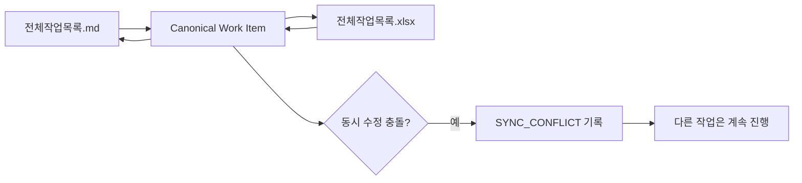
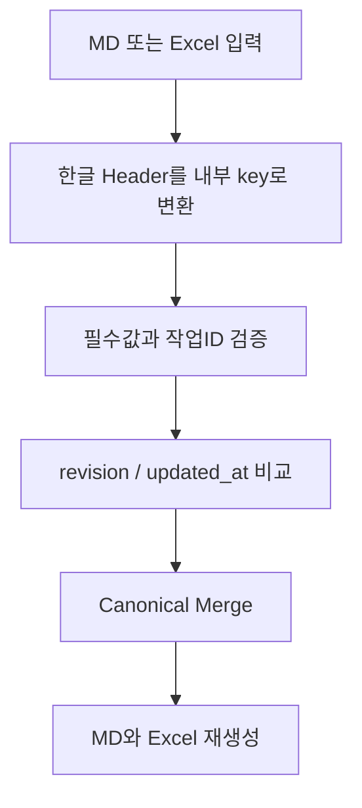
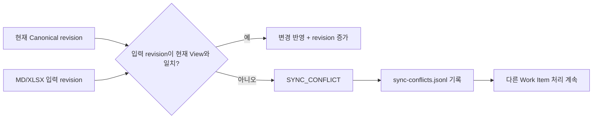

# 전체작업목록 MD↔Excel 동기화 가이드

## Quick Start

전체 작업 목록은 Markdown과 Excel 중 편한 View에서 수정할 수 있다. 동기화는 stable `작업ID`, `변경버전`, `최근변경일시`를 사용하며 충돌이 생겨도 다른 업무 진행은 막지 않는다.



## 1. 가장 간단한 사용법

Markdown을 수정한 경우:

```bash
python sdlc/scripts/sync_worklist.py sync --source md
```

Excel을 수정한 경우:

```bash
python sdlc/scripts/sync_worklist.py sync --source xlsx
```

단순 변환만 필요한 경우:

```bash
python sdlc/scripts/sync_worklist.py md-to-xlsx
python sdlc/scripts/sync_worklist.py xlsx-to-md
```

## 2. Source of Truth



- MD/XLSX는 사람이 사용하는 View다.
- `sdlc/canonical/work-items.json`이 동기화 시점의 Canonical 저장소다.
- 컬럼명/순서는 `sdlc/config/worklist-columns.yaml`을 따른다.
- 담당자, 계획일정, 공수는 비어 있어도 정상 처리한다.

## 3. 충돌 처리

같은 `작업ID`를 서로 다른 오래된 revision에서 수정한 경우 값을 자동 덮어쓰지 않는다.



기본 `sync` 명령은 충돌을 기록하고 exit code 0으로 종료하여 전체 Workflow를 강제로 막지 않는다. CI나 관리자 검증에서 충돌을 실패로 취급하려면 `--strict`를 사용한다.

```bash
python sdlc/scripts/sync_worklist.py sync --source md --strict
```

## 4. 주요 파일

| 파일 | 역할 |
|---|---|
| `docs/00_관리/전체작업목록.md` | Markdown 사용자 View |
| `docs/00_관리/전체작업목록.xlsx` | Excel 사용자 View |
| `sdlc/config/worklist-columns.yaml` | 한글 Header ↔ 내부 key 계약 |
| `sdlc/canonical/work-items.json` | Canonical Work Item 저장소 |
| `sdlc/runtime/sync-conflicts.jsonl` | 동기화 충돌 기록 |
| `sdlc/scripts/sync_worklist.py` | 변환/동기화 CLI |

## 5. 운영 원칙

1. `작업ID`는 rename이나 정렬과 무관하게 유지한다.
2. 사용자가 현재 Export된 View를 수정하면 sync 시 revision을 1 증가시킨다.
3. 오래된 View에서 수정한 값은 조용히 덮어쓰지 않는다.
4. 충돌은 해당 Work Item에만 영향을 주며 다른 RQ/TASK의 업무는 계속한다.
5. Excel의 사용자 표시 컬럼은 한글을 기본으로 유지한다.
6. 프로젝트별 용어 변경은 `worklist-columns.yaml` 또는 Overlay에서 관리한다.

## 6. 검증

표준 테스트:

```bash
python -m unittest discover -s tests -p 'test_*.py'
python sdlc/scripts/normalize_mermaid.py --check .
```

검증 범위는 MD→XLSX→MD, XLSX→MD→XLSX, Optional PM 필드, 계층 ID, revision 증가, stale revision 충돌, Non-blocking 동작이다.
