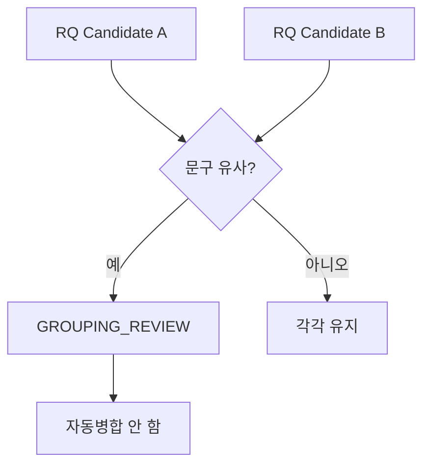

# 요구사항 Bulk Intake 가이드

## Quick Start

대량 요구사항 Excel은 각 행을 바로 최종 RQ로 확정하지 않고 원본을 보존한 뒤 RQ/FR Candidate를 생성한다.


## 실행

```text
python sdlc/scripts/import_requirements.py <요구사항목록.xlsx>
```

기본 Profile:

```text
sdlc/config/requirement-intake-columns.example.yaml
```

기본 출력:

```text
sdlc/canonical/intake/requirements-import.json
docs/00_관리/요구사항_인입결과.md
```

## 두 줄 Header

현재 PoC는 다음과 같은 2단 Header를 지원한다.

```text
업무구분        요구사항                         관리
Level1 Level2   요구사항 ID 요구사항명 요구사항   시작일 종료일 담당자
```

실제 Mapping은 Profile YAML에서 변경할 수 있다.

## Grouping 원칙

기본 RQ Candidate Key:

```text
Level1 + Level2 + 요구사항명 exact text
```

각 원본 행의 `요구사항 ID`와 `요구사항`은 FR Candidate에 연결한다.

```text
RQ Candidate
├ FR Candidate → 외부 요구사항 ID A
├ FR Candidate → 외부 요구사항 ID B
└ FR Candidate → 외부 요구사항 ID C
```

## 유사 제목

유사한 제목은 자동으로 병합하지 않는다.



사용자가 Review하지 않아도 각 Candidate는 별도로 다음 분석 단계로 진행할 수 있다.

## 원문 보존

NBSP, 맞춤법, 영문 표기 등이 있어도 원문을 덮어쓰지 않는다.

- `raw`: 입력 원문
- 정리된 field: 검색/그룹핑용 Derived 값

예:

```text
raw: 근태현황 조회
정리값: 근태현황 조회
```

## Error / Alert

### 외부 ID 중복

`DUPLICATE_EXTERNAL_ID` Alert를 생성하고 자동 overwrite하지 않는다.

### 필수 컬럼 누락 행

`INVALID_ROW`로 기록한다. 다른 정상 행 Import는 계속한다.

### Business Context 부족

`MISSING_BUSINESS_CONTEXT`를 생성한다. `현재 문제`, 확정 Business Rule 등을 Agent가 임의로 만들지 않는다.

## 현재 요구사항목록 적용 해석

현재 검증 파일의 142행은 구조적으로 다음 방식으로 처리한다.

- 외부 ID 142건 보존
- 동일 `Level1 + Level2 + 요구사항명`은 RQ Candidate로 묶음
- 각 세부 `요구사항`은 FR Candidate
- 일정/담당자 공란 허용
- 유사하지만 문구가 다른 상위 제목은 `GROUPING_REVIEW`

## 다음 단계

Bulk Intake 이후에는 `/work RQ-Candidate`에 해당하는 분석을 진행한다. 실제 Brownfield Source Repository가 연결되지 않은 상태에서는 Discovery/Impact의 Evidence 확정과 Source Write를 Deferred한다.
