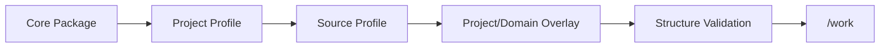

# Source 연결형 Harness Structure 가이드

## Quick Start

다른 프로젝트에 적용할 때는 Core를 그대로 두고 두 Profile과 Overlay만 설정한다.

1. `.cursor/`, `sdlc/templates/core`, Contract/Validator를 복사한다.
2. `project-profile.example.yaml` → `project-profile.yaml`.
3. `source-profile.example.yaml` → `source-profile.yaml` 후 Source root/build/test 설정.
4. 프로젝트 차이는 `sdlc/custom/project/`, Domain 차이는 `sdlc/custom/domain/<domain>/`에 둔다.
5. `python sdlc/scripts/validate_harness_structure.py .` 실행.
6. Requirement를 Intake하고 `/work`로 진행한다.

## Rule / Skill / Template 역할

- **Rule**: 프로젝트가 달라도 지켜야 할 invariant. 짧고 항상 적용.
- **Skill**: Stage 실행 절차와 Retrieval/Quality/Alert/Token 전략.
- **Template**: 사람이 보는 산출물 구조. Evidence/Traceability/Alert 자리를 고정.
- **Profile**: Source/Build/Test 등 프로젝트 사실.
- **Overlay**: 프로젝트/Domain 차이만 추가.

## Source Input 최소 Contract

- Source root
- Test root(있으면)
- Build/Test command(알면; 없어도 탐색 가능)
- 제외 경로
- Evidence hash 정책
- Target write confidence
- 위험 Action Guard 정책

Source 정보 일부가 없어도 전체 Workflow를 막지 않는다. 탐색 결과를 Candidate로 남기고 위험 write만 보류한다.

## 다른 프로젝트 Custom 우선순위

`Core → Preset → Project Profile → Project Overlay → Domain Overlay → Local Override`

Core를 직접 수정해야 하는 상황이면 단순 Project 차이가 아니라 Harness Candidate Design 변경인지 먼저 구분한다.
