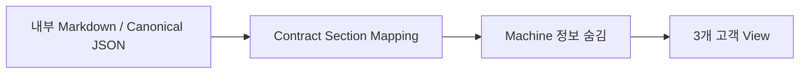

# 한글 산출물과 고객 커뮤니케이션 가이드

## 목적
Agent에 익숙하지 않은 설계자·개발자·고객이 같은 SDLC 산출물을 이해할 수 있도록 내부 Canonical과 사용자 표시 문서를 분리한다.

## 1. 내부 Canonical과 사람용 문서를 분리한다
- RQ/FR/BR/PGM/TASK/AC/TC 같은 식별자는 시스템 추적을 위해 유지한다.
- 사람에게 보이는 제목, 표 머리글, 설명, 질문은 한국어 자연어를 기본으로 한다.
- 내부 문서에서는 첫 등장 시 `기능 요구사항(FR)`처럼 한국어 명칭과 코드를 함께 적을 수 있다.
- 고객 문서에서는 내부 ID, Source Hash, Confidence, 내부 상태 코드를 기본적으로 숨기고 필요할 때 부록으로만 표시한다.

## 2. 고객 커뮤니케이션 View는 3개만 활성 사용한다
단계마다 별도 고객문서를 만드는 대신 고객과 실제로 대화하는 목적 기준으로 통합한다.

| 활성 View | 사용하는 내부 단계 | 고객과 하는 일 |
|---|---|---|
| 요구·업무·기능 합의서 | INTAKE, DECOMPOSE, CLARIFY, PROCESS, DESIGN | 요청, 업무흐름, 주요 기능, 업무규칙, 결정 필요사항을 확인·합의한다. |
| 영향·개발범위 공유서 | DISCOVERY, IMPACT, PROGRAM, DEVELOPMENT | 업무/시스템 영향, 개발 범위, 구현 상태와 제약을 공유한다. |
| 테스트·인수·운영 결과서 | TEST, VERIFY, KNOWLEDGE_PROMOTION | 인수기준, 테스트/검증 결과, 미수행 사항, 운영 인수 내용을 확인한다. |

기존 8개 고객문서 유형 ID는 삭제하지 않는다. 기존 자동화나 링크가 `design_review`, `test_acceptance` 같은 이름을 사용하면 `customer-document-contract.json`의 `legacy_document_aliases`를 통해 위 3개 View 중 하나로 변환한다. 신규 프로젝트에서는 8개 유형을 직접 선택하지 않는다.

## 3. 고객 문서는 실제 내부 산출물에서 Projection한다
`render_customer_document.py`는 더 이상 빈 Heading만 만드는 도구가 아니다. 내부 Markdown 산출물 또는 Canonical JSON Bundle을 입력받아 Contract의 Section Mapping을 실행한다.

예시:

```bash
python sdlc/scripts/render_customer_document.py \
  --type solution_agreement \
  --input docs/RQ-0042_요구사항.md \
  --input docs/RQ-0042_기능설계.md \
  --out docs/customer/RQ-0042_요구_업무_기능_합의서.md
```

디렉터리를 `--input`으로 넘기면 하위 Markdown/JSON 산출물을 읽고 해당 고객 View가 담당하는 Stage만 사용한다.

Projection 순서는 다음과 같다.



- `customer-document-contract.json`의 `projection_sections`, `base_section_sources`, `catalog_section_sources`가 내부→고객 Section 관계를 정의한다.
- 내부 ID, Source Hash, Locator, Confidence 등은 Profile 기본값에 따라 본문에서 제거한다.
- `OPEN`, `CONFIRMED_BUSINESS` 같은 내부 상태는 고객이 이해할 수 있는 한국어 표시로 바꾼다.
- 같은 내용이 여러 단계에 반복되어 있으면 기본적으로 최신 Stage를 우선하고 동일 내용은 중복 제거한다.
- 근거가 없는 `합의된 내용`이나 업무사실을 추정해서 만들지 않는다. Source에서 찾지 못한 Section은 “현재 제공된 내부 산출물에서 고객에게 공유할 확정 내용을 찾지 못했습니다.”로 표시한다.

## 4. 표준 필수 단락
모든 고객 View는 다음 공통 단락을 유지한다.

1. 문서 목적
2. 한눈에 보기
3. 고객과 함께 확인할 내용
4. 합의된 내용
5. 미확정 사항
6. 다음 단계

각 View 목적에 따라 요청/개선 비교, 업무 영향, 범위/제외범위, 테스트/인수기준, 운영 인수 등이 추가된다.

## 5. 고객별 선택 단락과 용어 변경
선택 여부는 `customer-document-profile`에서 프로젝트별로 결정한다. 필수 단락은 제거하지 않는다.

`terminology-profile` 또는 Profile의 `terminology_overrides`는 Canonical ID를 바꾸지 않고 표시 용어만 변경한다. 예를 들어 어떤 고객이 '요구사항' 대신 '업무요건', '프로그램' 대신 '개발기능'을 사용해도 내부 RQ/PGM 관계는 그대로 유지한다.

## 6. 고객 회의 결과의 반영
고객 문서는 독립적인 Truth Store가 아니다. 고객 회의에서 새로 확정되거나 변경된 내용은 고객 문서만 고치고 끝내지 않고 `/change` 또는 현재 `/work` Stage로 내부 Canonical/산출물에 먼저 반영한 뒤 고객 View를 다시 생성한다.
