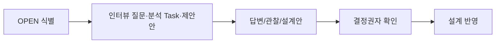

<!-- 작성 안내: 질문만 나열하지 않고 현재 알고 있는 내용, 추천 선택지, 답변 영향, 결정권자를 함께 적어 설계자/개발자가 실제 인터뷰를 진행할 수 있게 한다. -->
# {{representative_id}} {{short_name}} 확인 질문 및 OPEN 해소

## 문서 목적
{{purpose}}

## 한눈에 보기
{{summary}}

## 업무 흐름

## 입력 및 근거
| 구분 | 내용 | 사실/근거 구분 | 위치(Locator) | 원본 해시(Source Hash) | 신뢰도(Confidence) | 상태(Status) |
|---|---|---|---|---|---|---|
| 요구사항 | {{requirement_source}} | GIVEN | {{requirement_locator}} | - | HIGH | CURRENT |
| SOP/업무정책 | {{sop_summary}} | GIVEN/CONFIRMED 또는 없음 | {{sop_locator}} | {{sop_hash}} | {{sop_confidence}} | {{sop_status}} |
| 프로그램 소스/기존 시스템 | {{source_summary}} | OBSERVED | {{source_locator}} | {{source_hash}} | {{source_confidence}} | {{source_status}} |
| 프로젝트 표준 | {{standard_summary}} | PROJECT_STANDARD | {{standard_locator}} | - | {{standard_confidence}} | {{standard_status}} |

## 상세 내용
### 인터뷰·확인 질문
| OPEN ID | 질문 | 왜 필요한가 | 현재 알고 있는 내용 | 권장 선택지/예시 | 답변에 따라 바뀌는 영역 | 답변/결정권자 | 상태 |
|---|---|---|---|---|---|---|---|
{{question_rows}}

### 인터뷰 없이 분석으로 해소할 항목
| OPEN ID | 분석 방법 | 확인 대상 | 관찰 결과 | 근거 Locator | 상태 |
|---|---|---|---|---|---|
{{analysis_resolution_rows}}

### 설계자·개발자 제안 항목
| OPEN ID | 제안자 역할 | 제안 내용 | 선택 이유 | 대안 | 결정 영역 | 확인/채택 권한자 | 상태 |
|---|---|---|---|---|---|---|---|
{{proposal_rows}}

### 답변·분석·제안 반영 상태
| OPEN ID | 해소 방법 | 근거 구분 | 최종/제안 값 | 결정 상태 | 반영 산출물 |
|---|---|---|---|---|---|
{{answer_status_rows}}

## 미확정 사항·주의·가정
- SOP가 없어도 인터뷰, 기존 시스템/Source/Data 분석, Project Standard, 설계자/개발자 제안으로 OPEN을 줄일 수 있다.
- 설계자/개발자 경험은 `DESIGN_PROPOSAL`/`TECHNICAL_PROPOSAL`이며 업무 사실로 자동 확정하지 않는다.
- 기술 결정은 Project Authority Profile이 허용하면 고객 확인 없이 `ACCEPTED_DESIGN`으로 종료할 수 있다.
{{alerts_and_assumptions}}

## 관련 ID 및 추적성
{{traceability}}

## 다음 작업
{{next_step}}
