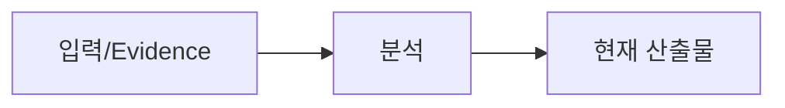

# {{representative_id}} {{short_name}} 확인질문

## 문서 목적
{{purpose}}

## 30초 요약
{{summary}}

## Workflow

## 입력/Evidence
| 구분 | 값 | Truth/Evidence | Locator | Source Hash | Confidence | Status |
|---|---|---|---|---|---|---|
| 요구사항 | {{requirement_source}} | GIVEN | {{requirement_locator}} | - | HIGH | CURRENT |
| Source | {{source_summary}} | OBSERVED | {{source_locator}} | {{source_hash}} | {{source_confidence}} | {{source_status}} |

## 본문
### 확인 질문
{{questions}}

### 답변 반영 상태
{{answer_status}}

## 미확정/Alert/Assumption
{{alerts_and_assumptions}}

## 관련 ID/Traceability
{{traceability}}

## 다음 작업
{{next_step}}
