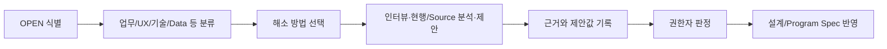

# {{representative_id}} {{short_name}} OPEN 해소 워크북

## 문서 목적
SOP나 완전한 선행문서가 없어도 설계자·개발자가 인터뷰, 현행 시스템 분석, Source/Data 분석, 프로젝트 표준, 전문경험 기반 제안을 통해 미확정 항목을 구조적으로 채우고 그 근거와 확정 권한을 분리해 기록한다.

## 한눈에 보기
| 구분 | 수량 |
|---|---:|
| 전체 OPEN | {{open_count}} |
| 분석 중 | {{analyzing_count}} |
| 제안됨 | {{proposed_count}} |
| 현행 관찰 완료 | {{observed_count}} |
| 설계 결정 완료 | {{accepted_design_count}} |
| 업무 확정 완료 | {{confirmed_business_count}} |
| 충돌/보류 | {{conflict_deferred_count}} |

## 업무 흐름

## 입력 및 근거
| 구분 | 내용 | 근거 구분 | 위치(Locator) | 상태 |
|---|---|---|---|---|
| 요구사항/기존 산출물 | {{requirement_source}} | GIVEN | {{requirement_locator}} | CURRENT |
| SOP/정책 | {{sop_source}} | GIVEN/CONFIRMED 또는 없음 | {{sop_locator}} | {{sop_status}} |
| 기존 시스템 | {{system_evidence}} | OBSERVED | {{system_locator}} | {{system_status}} |
| 프로그램 소스/데이터 | {{source_evidence}} | OBSERVED | {{source_locator}} | {{source_status}} |
| 프로젝트 표준 | {{project_standard}} | PROJECT_STANDARD | {{standard_locator}} | {{standard_status}} |

## 상세 내용
### OPEN 해소 목록
| OPEN ID | 관련 ID | 분류 | 결정 영역 | 현재 질문/Gap | 우선순위 | 해소 방법 | 관찰/제안 값 | 근거 또는 판단 이유 | 결정 권한자 | 상태 | 후속 영향 |
|---|---|---|---|---|---|---|---|---|---|---|---|
{{open_resolution_rows}}

### 6하원칙 업무정의 해소표
| 관점 | 현재 OPEN/부분정보 | 인터뷰로 확인할 질문 | 기존 시스템에서 확인할 것 | 설계자/개발자 제안 가능 내용 | 최종 값 | 근거 구분 | 상태 |
|---|---|---|---|---|---|---|---|
| 누가(Who) | {{who_current}} | {{who_interview}} | Role/Profile/Security/Data Scope | 역할명·권한 UX 후보 | {{who_final}} | {{who_basis}} | {{who_status}} |
| 언제(When) | {{when_current}} | {{when_interview}} | Scheduler/Trigger/마감/상태변화 | 합리적 Default/Trigger 후보 | {{when_final}} | {{when_basis}} | {{when_status}} |
| 어디서(Where) | {{where_current}} | {{where_interview}} | Menu/Route/Screen/Job/API | 신규 화면/메뉴 동선 후보 | {{where_final}} | {{where_basis}} | {{where_status}} |
| 무엇을(What) | {{what_current}} | {{what_interview}} | Field/DTO/Data Object | 입력·출력 Field 후보 | {{what_final}} | {{what_basis}} | {{what_status}} |
| 어떻게(How) | {{how_current}} | {{how_interview}} | CRUD/상태전이/호출 흐름 | UX/로직/예외 처리안 | {{how_final}} | {{how_basis}} | {{how_status}} |
| 왜(Why) | {{why_current}} | {{why_interview}} | 기존 문서의 설명은 참고만 | 업무 목적은 임의 발명 금지 | {{why_final}} | {{why_basis}} | {{why_status}} |

### 화면·필드·CRUD 해소표
| 항목 | 현재 정보 | 현행 분석 포인트 | 설계/개발 제안 | 채택 값 | 근거/사유 | 상태 |
|---|---|---|---|---|---|---|
| 화면/메뉴/채널 | {{ui_current}} | Route/Menu config/Screen Source | Layout/동선 후보 | {{ui_final}} | {{ui_basis}} | {{ui_status}} |
| 입력·출력 Field | {{field_current}} | UI/DTO/API/DB Validation | Field/Type/필수/Default 후보 | {{field_final}} | {{field_basis}} | {{field_status}} |
| CRUD | {{crud_current}} | Controller/Service/Repository | 사용자 행위와 Transaction 후보 | {{crud_final}} | {{crud_basis}} | {{crud_status}} |

### 업무 규칙·상태·예외 해소표
| 구분 | 현재 정보 | 인터뷰/현행 분석 포인트 | 제안 가능 범위 | 최종 값 | 결정 영역 | 상태 |
|---|---|---|---|---|---|---|
| 업무 규칙 | {{br_current}} | 조건/판단/결과/예외 | 구현 관찰은 BR 후보까지만 | {{br_final}} | BUSINESS | {{br_status}} |
| 상태 전이 | {{state_current}} | 승인/반려/마감/취소/복구 | 상태모델 후보 | {{state_final}} | FUNCTIONAL | {{state_status}} |
| 예외/오류 | {{exception_current}} | 실패/재처리/중복/오류 메시지 | 기술 예외 처리안 | {{exception_final}} | FUNCTIONAL/TECHNICAL | {{exception_status}} |

### 데이터·조회·공통코드 해소표
| 구분 | 현재 정보 | 기존 시스템/Source 분석 | 개발자 제안 가능 범위 | 최종 값 | 결정 영역 | 상태 |
|---|---|---|---|---|---|---|
| Table/Column | {{table_current}} | Schema/Migration/Mapper | 신규 물리모델 후보 | {{table_final}} | DATA | {{table_status}} |
| 조회 Query | {{query_current}} | WHERE/JOIN/ORDER/GROUP/Paging | Query/Index 후보 | {{query_final}} | DATA/TECHNICAL | {{query_status}} |
| 공통코드/기준정보 | {{code_current}} | Enum/Code Table/기준정보 API | 신규 코드 필요성 제안 | {{code_final}} | FUNCTIONAL/DATA | {{code_status}} |

### 연계·권한·NFR·테스트 해소표
| 구분 | 현재 정보 | 확인/분석 포인트 | 제안 가능 범위 | 최종 값 | 결정 영역 | 상태 |
|---|---|---|---|---|---|---|
| 연계 | {{integration_current}} | API/Event/File/Batch/Payload/Retry | 기술 계약 후보 | {{integration_final}} | INTEGRATION | {{integration_status}} |
| 권한 | {{auth_current}} | Role/Profile/Data Scope/Security | UX/기술 집행안 | {{auth_final}} | BUSINESS/TECHNICAL | {{auth_status}} |
| NFR | {{nfr_current}} | SLA/보안/감사/성능 표준 | 프로젝트 표준 기반 후보 | {{nfr_final}} | TECHNICAL/QUALITY | {{nfr_status}} |
| AC/TC | {{actc_current}} | 성공/실패/경계값/테스트 데이터 | 테스트 시나리오 후보 | {{actc_final}} | QUALITY/FUNCTIONAL | {{actc_status}} |

### 결정 기록
| 결정 ID | OPEN ID | 결정 내용 | 결정자 역할 | 결정 영역 | 근거 | 날짜 | 상태 |
|---|---|---|---|---|---|---|---|
{{decision_rows}}

## 미확정 사항·주의·가정
- 설계자/개발자의 경험은 `DESIGN_PROPOSAL` 또는 `TECHNICAL_PROPOSAL`로 기록하며 업무 사실로 자동 확정하지 않는다.
- Brownfield의 현재 시스템 동작은 `OBSERVED_AS_IS`이며 개선 후 정책(TO-BE)과 동일하다고 가정하지 않는다.
- 기술 영역은 프로젝트 권한 Profile이 허용하면 고객 확인 없이 `ACCEPTED_DESIGN`으로 해소할 수 있다.
- 업무 목적·업무 규칙·권한 정책 등 BUSINESS 영역은 권한 있는 업무 담당자의 확인 없이 `CONFIRMED_BUSINESS`로 올리지 않는다.
{{alerts_and_assumptions}}

## 관련 ID 및 추적성
{{traceability}}

## 다음 작업
{{next_step}}
