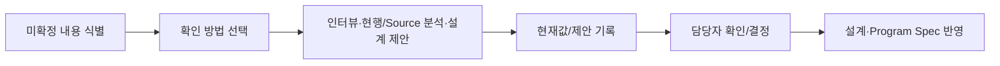

# {{representative_id}} {{short_name}} 미확정 사항 해소표

<!-- 사람은 확인할 내용·확인방법·현재값/제안·담당·상태만 관리한다. category/decision_domain/resolution_method/basis_class/internal status/downstream impact 등은 가능한 경우 Agent/Script가 내부 metadata로 관리한다. -->

## 문서 목적
설계와 개발을 진행하면서 아직 확정되지 않은 내용을 한 곳에서 관리한다. 고객/업무 담당자에게 확인할 것, 현행 시스템이나 Source에서 확인할 것, 설계자·개발자가 제안할 것을 구분하되 내부 분류 코드를 사용자가 직접 외우거나 입력하지 않도록 한다.

## 한눈에 보기
| 구분 | 수량 |
|---|---:|
| 미확정 | {{human_open_count}} |
| 확인중 | {{human_checking_count}} |
| 제안 | {{human_proposed_count}} |
| 확정 | {{human_resolved_count}} |
| 보류 | {{human_deferred_count}} |

## 업무 흐름

## 입력 및 근거
| 구분 | 내용 | 근거 위치 | 상태 |
|---|---|---|---|
| 요구사항/기존 산출물 | {{requirement_source}} | {{requirement_locator}} | {{requirement_status}} |
| 업무자료/SOP/정책 | {{sop_source}} | {{sop_locator}} | {{sop_status}} |
| 기존 시스템/화면 | {{system_evidence}} | {{system_locator}} | {{system_status}} |
| 프로그램 Source/Data | {{source_evidence}} | {{source_locator}} | {{source_status}} |
| 프로젝트 표준 | {{project_standard}} | {{standard_locator}} | {{standard_status}} |

## 상세 내용
### OPEN 해소 목록
| OPEN ID | 관련 항목 | 무엇을 확인하거나 결정해야 하는가 | 어떻게 확인할 것인가 | 현재 확인된 내용 또는 제안 | 누가 확인하거나 결정하는가 | 진행 상태 |
|---|---|---|---|---|---|---|
{{open_resolution_human_rows}}

> 진행 상태는 `미확정 / 확인중 / 제안 / 확정 / 보류`만 사용한다. 현행 확인 결과는 TO-BE 정책으로 자동 확정하지 않는다.

### 업무 시나리오 확인
6하원칙 중 실제 설계 결과를 바꾸는 미확정 항목만 적는다. 이미 확정된 값은 Functional Design에서 관리하고 여기에서 반복하지 않는다.

| 관점 | 현재 확인된 내용 | 추가로 확인할 내용 | 확인 방법/질문 | 최종 반영 위치 | 진행 상태 |
|---|---|---|---|---|---|
| 누가 | {{who_current}} | {{who_gap}} | {{who_action}} | {{who_target}} | {{who_human_status}} |
| 언제 | {{when_current}} | {{when_gap}} | {{when_action}} | {{when_target}} | {{when_human_status}} |
| 어디서 | {{where_current}} | {{where_gap}} | {{where_action}} | {{where_target}} | {{where_human_status}} |
| 무엇을 | {{what_current}} | {{what_gap}} | {{what_action}} | {{what_target}} | {{what_human_status}} |
| 어떻게 | {{how_current}} | {{how_gap}} | {{how_action}} | {{how_target}} | {{how_human_status}} |
| 왜 | {{why_current}} | {{why_gap}} | {{why_action}} | {{why_target}} | {{why_human_status}} |

### 설계 확인 항목
화면/필드/CRUD/업무규칙/Data/연계/권한/예외/NFR/테스트 중 실제로 미확정인 항목만 생성한다.

| 영역 | 현재 확인된 내용 | 확인 또는 설계할 내용 | 확인 방법/제안 | 담당 역할 | 진행 상태 | 반영 대상 |
|---|---|---|---|---|---|---|
{{design_resolution_rows}}

### 결정 기록
| 결정 ID | 관련 OPEN | 결정 내용 | 결정/확인 역할 | 근거 | 날짜 | 반영 대상 |
|---|---|---|---|---|---|---|
{{decision_rows}}

### 내부 자동 관리 정보
<!-- 기본 사용자/고객 View에서는 숨긴다. Agent/Validator/Trace가 필요할 때만 생성한다. -->
{{open_resolution_machine_metadata}}

## 미확정 사항·주의·가정
- 설계자/개발자의 경험 기반 값은 제안으로 기록하고 업무 사실로 자동 확정하지 않는다.
- Brownfield 현행 동작은 현재 시스템 관찰 결과이며 개선 후 정책과 같다고 가정하지 않는다.
- 프로젝트 권한으로 확정 가능한 기술 항목은 불필요하게 고객 승인 대기로 남기지 않는다.
- 업무 목적·정책·권한 같은 Business Truth는 권한 있는 업무 담당자 확인 없이 확정하지 않는다.
{{alerts_and_assumptions}}

## 관련 ID 및 추적성
{{traceability}}

## 다음 작업
{{next_step}}
