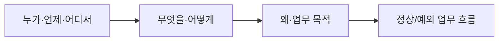

<!-- 작성 안내: 업무 정의는 6하원칙을 빠짐없이 표시한다. 확인되지 않은 항목을 발명하지 말고 OPEN으로 둔다. -->
# {{representative_id}} {{short_name}} 업무 프로세스 분석

## 문서 목적
{{purpose}}

## 한눈에 보기
{{summary}}

## 업무 흐름

## 입력 및 근거
| 구분 | 내용 | 사실/근거 구분 | 위치(Locator) | 원본 해시(Source Hash) | 신뢰도(Confidence) | 상태(Status) |
|---|---|---|---|---|---|---|
| 요구사항 | {{requirement_source}} | GIVEN | {{requirement_locator}} | - | HIGH | CURRENT |
| SOP/업무 문서 | {{business_document_summary}} | {{business_document_truth_type}} | {{business_document_locator}} | {{business_document_hash}} | {{business_document_confidence}} | {{business_document_status}} |
| 프로그램 소스/시스템 근거 | {{source_summary}} | OBSERVED | {{source_locator}} | {{source_hash}} | {{source_confidence}} | {{source_status}} |

## 상세 내용
### 업무 정의(6하원칙)
| 시나리오 ID | 누가(Who) | 언제(When) | 어디서(Where) | 무엇을(What) | 어떻게(How) | 왜(Why) | 상태/근거 |
|---|---|---|---|---|---|---|---|
{{six_w_scenario_rows}}

**자연어 업무 정의**  
{{six_w_natural_statement}}

### 업무 참여자·역할·프로파일·권한
{{actors_roles_profiles}}

### 업무 시작 조건과 수행 시점
{{triggers_frequency_timing}}

### 현재(AS-IS) 업무 흐름
{{as_is_process}}

### 개선(TO-BE) 업무 흐름
{{to_be_process}}

### 업무 단계별 입력·처리·결과
| 단계 | 수행자 | 입력 | 처리/판단 | 결과 | 다음 상태 | 근거 |
|---|---|---|---|---|---|---|
{{process_step_rows}}

### 상태·예외·업무 규칙
{{state_exception_rules}}

### 업무 데이터·기준정보
{{business_data_and_reference}}

### 확인이 필요한 업무 정책
{{business_policy_questions}}

## 미확정 사항·주의·가정
{{alerts_and_assumptions}}

## 관련 ID 및 추적성
{{traceability}}

## 다음 작업
{{next_step}}
