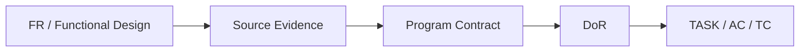

# {{representative_id}} {{short_name}} 프로그램설계

## 문서 목적
{{purpose}}

## 30초 요약
{{summary}}

## Workflow

## 입력/Evidence
| 구분 | 값 | Truth/Evidence | Locator | Source Hash | Confidence | Status |
|---|---|---|---|---|---|---|
| 요구사항 | {{requirement_source}} | GIVEN | {{requirement_locator}} | - | HIGH | CURRENT |
| Source | {{source_summary}} | {{source_truth_type}} | {{source_locator}} | {{source_hash}} | {{source_confidence}} | {{source_status}} |

## 본문
### Program Identity / Traceability
- PGM: {{program_id}}
- FR: {{fr_id}}
- External Requirement ID: {{external_requirement_id}}
- Change Type: {{change_type}}
- Spec Level: {{spec_level}}
- Implementation Readiness: {{implementation_readiness}}

### Entry Point / Target
- Kind: {{entry_point_kind}}
- Endpoint/Job/Adapter: {{entry_point_locator}}
- Application Service: {{service_locator}}
- Repository/Mapper: {{repository_locator}}
- Target Confidence: {{target_confidence}}

### Physical Artifact / Symbol Evidence
| Artifact | Symbol | Locator | Source Hash | Evidence Status |
|---|---|---|---|---|
{{artifact_evidence_rows}}

### Input DTO Contract
| Field | Type | Required | Evidence Status | Validation |
|---|---|---|---|---|
{{input_contract_rows}}

### Output DTO Contract
| Field | Type | Evidence Status | Meaning |
|---|---|---|---|
{{output_contract_rows}}

### Business Validation / Decision / State
{{business_rules}}

### Data / Persistence
- Logical Data: {{logical_data}}
- Actual Table/Column: {{actual_table_column}}
- Query/Mutation: {{persistence_operation}}
- SQL/Mapper Evidence: {{persistence_evidence}}
- Migration/Backfill: {{migration_backfill}}

### Transaction / Concurrency / Idempotency
- Transaction: {{transaction}}
- Isolation/Lock: {{concurrency}}
- Idempotency: {{idempotency}}
- Retry/Duplicate: {{retry_duplicate}}

### Integration / Notification Contract
- Channel/System: {{integration_channel}}
- Message Schema: {{message_schema}}
- Timeout/Retry/DLQ: {{integration_resilience}}
- Payload Mapping: {{payload_mapping}}

### Exception / Error Contract
{{exceptions}}

### Security / Audit / Observability
- Authorization: {{authorization}}
- Sensitive Data / Masking: {{sensitive_data}}
- Audit: {{audit}}
- Logging/Metric/Trace: {{observability}}

### NFR / Operations
- SLA/Latency: {{sla}}
- Volume/Batch Window: {{volume}}
- Pagination/Streaming: {{pagination}}
- Retention/Recovery: {{operations}}

### Applicable Standards / Standard Deviation
{{standards}}

### AC / TC Mapping
{{ac_tc_mapping}}

### Development Task / Scope Guard
{{development_tasks}}

### Definition of Ready
| DoR Field | Status | Evidence / OPEN Reason |
|---|---|---|
{{dor_rows}}

- OPEN Count: {{dor_open_count}}
- Readiness Verdict: {{readiness_verdict}}

## 미확정/Alert/Assumption
{{alerts_and_assumptions}}

## 관련 ID/Traceability
{{traceability}}

## 다음 작업
{{next_step}}
