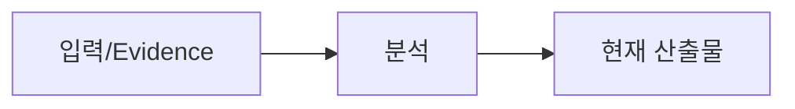

# {{representative_id}} {{short_name}} 프로그램설계

## 문서 목적
{{purpose}}

## 30초 요약
{{summary}}

## Workflow

## 입력/Evidence
| 구분 | 값 | Truth/Evidence | Locator | Source Hash | Confidence | Status |
|---|---|---|---|---|---|---|
| 요구사항 | {{requirement_source}} | GIVEN | {{requirement_locator}} | - | HIGH | CURRENT |
| Source | {{source_summary}} | OBSERVED | {{source_locator}} | {{source_hash}} | {{source_confidence}} | {{source_status}} |

## 본문
### Program Identity
- PGM: {{program_id}}
- Change Type: {{change_type}}
- Spec Level: {{spec_level}}

### Physical Artifact / Symbol Evidence
| Artifact | Symbol | Locator | Source Hash | Evidence Status |
|---|---|---|---|---|
{{artifact_evidence_rows}}

### 역할 / 변경 이유
{{role_and_reason}}

### AS-IS / TO-BE
{{program_as_is_to_be}}

### Call / Data / Transaction
{{call_data_transaction}}

### Exception / Error
{{exceptions}}

### Applicable Standards / Standard Deviation
{{standards}}

### AC / TC Mapping
{{ac_tc_mapping}}

## 미확정/Alert/Assumption
{{alerts_and_assumptions}}

## 관련 ID/Traceability
{{traceability}}

## 다음 작업
{{next_step}}
