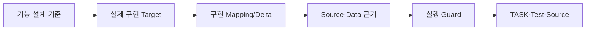

<!-- 작성 안내: 이 문서는 Functional Design의 업무/기능 의미를 반복하지 않는다. 기능 설계를 기준점으로 삼고 실제 구현 Target, Mapping 차이, Source/Data/Integration 근거, 실행 제어와 구현 준비도만 기록한다. -->
# {{representative_id}} {{short_name}} 프로그램 구현 명세

## 문서 목적
{{purpose}}

> 업무 시나리오, 화면/Field의 업무 의미, CRUD 의미, Business Rule, 논리 Data 요구, 업무 예외는 Functional Design을 기준으로 한다. 이 문서에는 구현을 위해 추가되거나 달라지는 내용만 기록한다.

## 한눈에 보기
{{summary}}

## 업무 흐름

## 입력 및 근거
<!-- Source Evidence Machine Contract: Locator / Source Hash / Confidence / Status -->
| 구분 | 내용 | 근거 구분 | 위치(근거 위치) | 원본 해시 | 상태 |
|---|---|---|---|---|---|
| 기능 설계 | {{functional_design_ref}} | CONFIRMED/GIVEN/PROPOSED | {{functional_design_locator}} | {{functional_design_hash}} | {{functional_design_status}} |
| 프로그램 소스/시스템 | {{source_summary}} | OBSERVED | {{source_locator}} | {{source_hash}} | {{source_status}} |
| 프로젝트 표준 | {{project_standard_summary}} | PROJECT_STANDARD | {{project_standard_locator}} | {{project_standard_hash}} | {{project_standard_status}} |

## 상세 내용
### 기능 설계 기준점
- 기능 설계 문서/버전: {{functional_design_ref}}
- 기능 요구사항(FR): {{fr_id}}
- 업무 시나리오(SCN): {{scenario_ids}}
- 이 PGM이 담당하는 기능 설계 범위: {{functional_scope_ref}}
- 기능 설계에서 변경 없이 그대로 따르는 내용: {{inherited_functional_behavior}}
- 기능 설계와 구현 사이에 추가 확인이 필요한 내용: {{functional_design_open_refs}}

### 실제 구현 Target
- 프로그램(PGM): {{program_id}}
- 변경 유형: {{change_type}}
- 실행 유형: {{entry_point_kind}}
- 화면/API/배치/이벤트 진입점: {{entry_point_locator}}
- 애플리케이션 서비스: {{service_locator}}
- 저장소/매퍼/Client: {{repository_locator}}
- 실제 변경 대상 신뢰 수준: {{target_confidence}}
- 실제 Source가 아직 없으면: `OPEN_REAL_SOURCE`

#### 실제 파일·심볼 근거
| 파일/자산 | 클래스·메서드·심볼 | 근거 위치 | 원본 해시 | 근거 상태 |
|---|---|---|---|---|
{{artifact_evidence_rows}}

### 구현 매핑과 차이
기능 설계에 정의된 항목을 다시 설명하지 말고 실제 구현 위치 또는 차이만 적는다.

| 기능 설계 항목/ID | 구현 대상 | UI/DTO/API/DB Mapping | 구현 차이 또는 추가 제약 | 상태 |
|---|---|---|---|---|
{{implementation_mapping_rows}}

#### 입력/출력 기술 계약
| 구분 | 기술 항목 | 자료형/형식 | 실제 Mapping | 추가 Validation/제약 | 상태 |
|---|---|---|---|---|---|
{{technical_io_contract_rows}}

### Query·Table·Source 구현 근거
- 실제 Mapper/Repository/Query: {{query_primary_assets}}
- 실제 Table/View/Column: {{actual_table_column}}
- WHERE/Join/Order/Group/Paging의 기능 설계 대비 구현 차이: {{query_implementation_delta}}
- 권한/Data Scope Filter 구현: {{query_security_filter}}
- 성능 고려(Index/N+1/대량조회): {{query_performance}}
- SQL/Mapper/Schema 실제 근거 또는 Greenfield 승인 설계: {{query_evidence_or_candidate}}
- 공통코드/기준정보 실제 구현 위치: {{common_code_implementation}}

### 트랜잭션·실행 제어
- 트랜잭션 범위: {{transaction}}
- 동시성/잠금: {{concurrency}}
- 중복 실행 방지(Idempotency): {{idempotency}}
- Retry/중복 요청 처리: {{retry_duplicate}}
- Scheduler/Feature Flag/Runtime Config: {{runtime_control}}

### 연계 구현 계약
기능 설계의 연계 필요성을 다시 설명하지 않고 실제 기술 계약만 기록한다.

| 대상 시스템/프로그램 | 실제 Protocol/Topic/API/File | 요청/응답 또는 Payload Mapping | Timeout/Retry | 실패 보관/재처리 | 상태 |
|---|---|---|---|---|---|
{{integration_implementation_rows}}

### 기술 제어와 운영 조건
- 기술 오류/Exception Mapping: {{technical_exceptions}}
- 인증/인가 구현 위치: {{authorization_implementation}}
- 민감정보/마스킹: {{sensitive_data}}
- 감사 기록: {{audit}}
- 로그/지표/추적: {{observability}}
- SLA/처리량/운영 제약의 구현 반영: {{operational_constraints}}
- 적용 표준 및 예외: {{standards}}

### TASK·AC·TC·Source 연결
| 개발 작업(TASK) | 기능/AC | 테스트(TC) | 변경 Source/자산 | 상태 |
|---|---|---|---|---|
{{delivery_trace_rows}}

### 구현 준비도
17개 준비도 항목은 별도 Section을 반복 생성하지 않고 이 표 하나에서 관리한다.

| 확인 항목 | 상태(확정/미확정/비적용) | 근거 또는 미확정 이유 | 개발 영향 |
|---|---|---|---|
| 기능 설계 기준 | {{dor_functional_design_ref_status}} | {{dor_functional_design_ref_basis}} | {{dor_functional_design_ref_impact}} |
| 실제 구현 대상 | {{dor_implementation_target_status}} | {{dor_implementation_target_basis}} | {{dor_implementation_target_impact}} |
| 소스 근거 | {{dor_source_evidence_status}} | {{dor_source_evidence_basis}} | {{dor_source_evidence_impact}} |
| 입출력 구현 매핑 | {{dor_io_mapping_status}} | {{dor_io_mapping_basis}} | {{dor_io_mapping_impact}} |
| 조회·저장 데이터 | {{dor_query_data_status}} | {{dor_query_data_basis}} | {{dor_query_data_impact}} |
| 공통코드·기준정보 | {{dor_common_code_status}} | {{dor_common_code_basis}} | {{dor_common_code_impact}} |
| 트랜잭션 | {{dor_transaction_status}} | {{dor_transaction_basis}} | {{dor_transaction_impact}} |
| 동시성·중복 방지 | {{dor_concurrency_status}} | {{dor_concurrency_basis}} | {{dor_concurrency_impact}} |
| 연계 기술 계약 | {{dor_integration_status}} | {{dor_integration_basis}} | {{dor_integration_impact}} |
| 오류·예외 처리 | {{dor_error_status}} | {{dor_error_basis}} | {{dor_error_impact}} |
| 인증·인가·보안 | {{dor_security_status}} | {{dor_security_basis}} | {{dor_security_impact}} |
| 감사·로그·관측 | {{dor_observability_status}} | {{dor_observability_basis}} | {{dor_observability_impact}} |
| 성능·운영 조건 | {{dor_nfr_status}} | {{dor_nfr_basis}} | {{dor_nfr_impact}} |
| 적용 표준·예외 | {{dor_standards_status}} | {{dor_standards_basis}} | {{dor_standards_impact}} |
| 개발 작업·변경 소스 | {{dor_task_source_status}} | {{dor_task_source_basis}} | {{dor_task_source_impact}} |
| 인수조건·테스트 연결 | {{dor_ac_tc_status}} | {{dor_ac_tc_basis}} | {{dor_ac_tc_impact}} |
| 남은 미확정·실행 가드 | {{dor_open_guard_status}} | {{dor_open_guard_basis}} | {{dor_open_guard_impact}} |

- 남은 구현 OPEN 수: {{dor_open_count}}
- 구현 준비 판정: {{readiness_verdict}}
- Source write Guard: {{execution_guard}}

## 미확정 사항·주의·가정
{{alerts_and_assumptions}}

## 관련 ID 및 추적성
{{traceability}}

## 다음 작업
{{next_step}}
