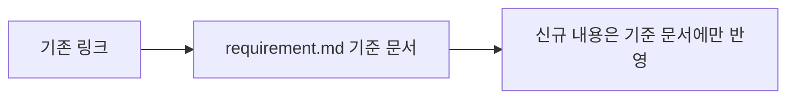

<!-- Legacy compatibility only. 신규 Workflow는 sdlc/templates/core/requirement.md 하나에서 원문/FR/BR 후보/AC를 함께 관리한다. 이 View에 새 업무정보를 작성하지 않는다. -->
# {{representative_id}} {{short_name}} 요구사항 분석 — 호환용 View

## 문서 목적
기존 링크나 자동화가 `requirement-analysis.md`를 참조하는 동안 사용할 임시 호환 View다. 신규 요구사항 분석의 기준 문서는 `requirement.md`이며 이 문서는 별도 Source of Truth가 아니다.

## 한눈에 보기
- 기준 요구사항 문서: {{requirement_ref}}
- 호환 상태: DEPRECATED_COMPATIBILITY_VIEW
- 신규 작성 허용: 아니오

## 업무 흐름

## 입력 및 근거
<!-- Source Evidence Machine Contract: Locator / Source Hash / Confidence / Status -->
| 구분 | 내용 | 위치(Locator) | 원본 해시(Source Hash) | 신뢰도(Confidence) | 상태(Status) |
|---|---|---|---|---|---|
| 기준 Requirement | {{requirement_ref}} | {{requirement_locator}} | {{requirement_hash}} | HIGH | CURRENT |

## 상세 내용
### 기준 문서 참조
{{requirement_ref}}

이 View에서 FR/BR/AC를 다시 작성하지 않는다. 기존 소비자가 상세 내용이 필요하면 기준 Requirement Artifact의 다음 Section을 읽는다.
- 원문과 식별정보
- 현재 문제 또는 요청 내용
- 업무 목표와 기대 결과
- 범위와 반드시 유지할 조건
- 기능 요구사항(FR)
- 업무 규칙(BR) 후보
- 인수 조건(AC)

## 미확정 사항·주의·가정
- 이 파일이 존재한다는 이유로 Requirement와 Requirement Analysis를 두 개의 활성 산출물로 취급하지 않는다.
- 호환 소비자가 제거되면 파일 삭제를 검토한다.
{{alerts_and_assumptions}}

## 관련 ID 및 추적성
{{traceability}}

## 다음 작업
기준 문서 `{{requirement_ref}}`를 사용해 CLARIFY 또는 PROCESS로 진행한다.
