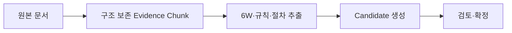

# {{representative_id}} {{short_name}} SOP/업무문서 추출 결과

## 문서 목적
{{purpose}}

## 한눈에 보기
{{summary}}

## 업무 흐름

## 입력 및 근거
| 문서 ID | 문서 유형 | 위치(Locator) | 내용 유형 | 원본 해시(Source Hash) | 추출 상태 | 신뢰도 |
|---|---|---|---|---|---|---|
{{evidence_rows}}

## 상세 내용
### 문서 맥락
{{document_context}}

### 업무 시나리오(6하원칙) 후보
| 시나리오 ID | 누가(Who) | 언제(When) | 어디서(Where) | 무엇을(What) | 어떻게(How) | 왜(Why) | 근거 상태 |
|---|---|---|---|---|---|---|---|
{{six_w_rows}}

### 역할·프로파일·권한 후보
{{actor_role_profile_candidates}}

### 절차·업무 프로세스 후보
{{process_candidates}}

### Business Rule 후보
| 후보 ID | 조건 | 판단/행동 | 결과 | 예외 | 원문 위치 | 검토 상태 |
|---|---|---|---|---|---|---|
{{business_rule_rows}}

### 상태·승인·예외·Escalation
{{state_approval_exception_candidates}}

### 데이터 항목·필드·공통코드 후보
{{data_field_code_candidates}}

### 화면·메뉴·양식 후보
{{screen_form_candidates}}

### 연계·배치·이벤트 후보
{{integration_candidates}}

### 통제·감사·SLA·마감 조건
{{control_sla_candidates}}

### 충돌·모호성·확인 질문
{{conflicts_and_questions}}

## 미확정 사항·주의·가정
{{alerts_and_assumptions}}

## 관련 ID 및 추적성
{{traceability}}

## 다음 작업
{{next_step}}
