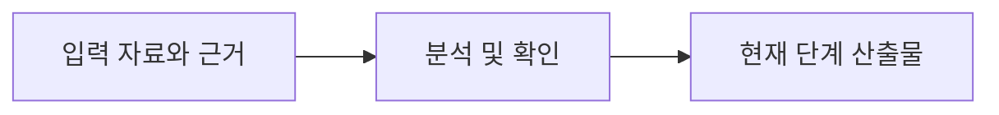

<!-- 작성 안내: 본문은 Agent 용어를 전제로 하지 않고 한국어 자연어로 작성한다. RQ/FR/BR/PGM/AC/TC 같은 코드는 첫 등장 시 한국어 명칭을 함께 적고 이후 추적용 식별자로 사용한다. -->
# {{representative_id}} {{short_name}} 테스트 시나리오

## 문서 목적
{{purpose}}

## 한눈에 보기
{{summary}}

## 업무 흐름

## 입력 및 근거
| 구분 | 내용 | 사실/근거 구분 | 위치(Locator) | 원본 해시(Source Hash) | 신뢰도(Confidence) | 상태(Status) |
|---|---|---|---|---|---|---|
| 요구사항 | {{requirement_source}} | GIVEN | {{requirement_locator}} | - | HIGH | CURRENT |
| 프로그램 소스/시스템 근거 | {{source_summary}} | OBSERVED | {{source_locator}} | {{source_hash}} | {{source_confidence}} | {{source_status}} |

## 상세 내용
### 인수 조건(AC)과 테스트케이스(TC) 연결
| 인수 조건(AC) | 테스트케이스(TC) | 대상 프로그램/소스 | 테스트 유형 | 기대 결과 | 상태 |
|---|---|---|---|---|---|
{{test_case_rows}}

### 테스트 수행 근거
{{test_execution_evidence}}

### 미수행 항목과 회귀 테스트 범위
{{remaining_tests}}

## 미확정 사항·주의·가정
{{alerts_and_assumptions}}

## 관련 ID 및 추적성
{{traceability}}

## 다음 작업
{{next_step}}
